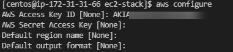

Installation of AWS CLI 

https://docs.aws.amazon.com/cli/latest/userguide/install-linux.html

After Installation of AWS CLI package the cli commands could be run post configuring the details

```
aws configure
```

Grab the Access Key and Secret Key from console while setting up the IAM User




Access Keys and Secret keys are used in SDK/ codes that runs on on-prem machines.

Check the sts user using the below commands


Due to security vulnerabilities it's advisable to rotate the IAM access keys periodically

Now, there are other ways of running aws cli commands if running on an EC2 instance

We can create an Instance Profile and associate an EC2 instance to that Instance Profile, whatever IAM Roles that are attached on the instance profile, the machine inherits the privilege

How to set up Instance Profile?
Create the IAM role with necessary permissions that are needed for the aws commands to run on the EC2 with the instance profile 

aws iam create-instance-profile --instance-profile-name EC2-Instance-Profile
aws iam add-role-to-instance-profile --instance-profile-name EC2-Instance-Profile --role-name EC2-Role
Check the current user as below


