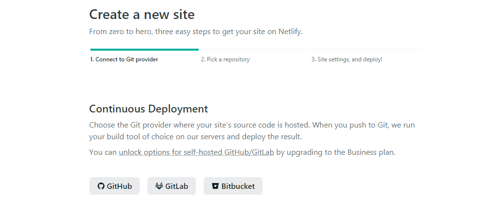
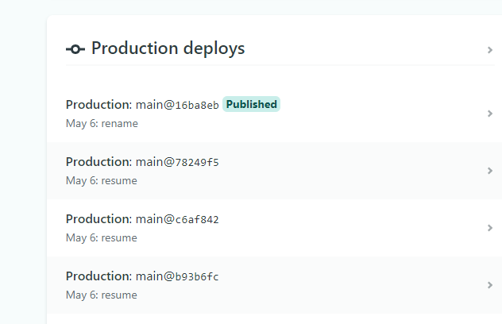

##### Install node.js and npm 

```sh
# install nodejs
$ sudo apt install nodejs

# verify the installation
$ node -v

# install npm
$ sudo apt install npm

# verify the installation
$ npm -v 
```


##### Download latest nvm version 
```sh
$ curl -o- https://raw.githubusercontent.com/nvm-sh/nvm/v0.35.1/install.sh | bash

# verify the installation
$ nvm --versionOpen up a new tab in your browser and navigate to http://localhost:8000/

Congrats, you have successfully setted up the development environment locally.
```

##### Setup Gatsby CLI 
```cd   
$ npm install -g gatsby-cli
Open up a new tab in your browser and navigate to http://localhost:8000/

Congrats, you have successfully setted up the development environment locally.
```

##### Create Gatsby Blog

```
# generate new blog using starter
$ gatsby new blog https://github.com/gatsbyjs/gatsby-starter-blog

# change the working directory
cd blog

# start the development server
$ gatsby develop
```

##### View your site locally
Open up a new tab in your browser and navigate to http://localhost:8000/

Congrats, you have successfully setted up the development environment locally.



Post importing the GitHub repo to Netlify, continuos deployment happens and we could see as below



Yayy!! the first Gatsby blog site is ready and hosted in Netlify
